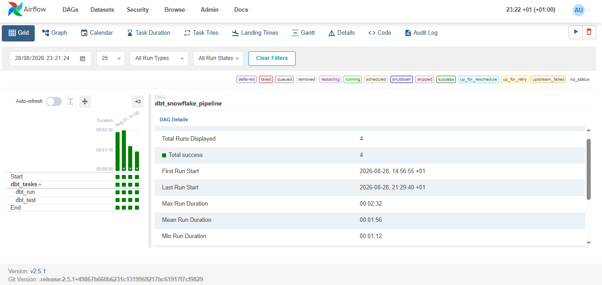

# 🚀 Modern Data Engineering Project with Snowflake, dbt, Airflow, Power BI & Docker


## 📌 Overview

This project demonstrates a modern **Data Engineering** pipeline using:

- **Snowflake** as the cloud data warehouse
- **dbt (Data Build Tool)** for data modeling and transformation
- **Apache Airflow** for workflow orchestration with **CeleryExecutor**
- **Docker** for containerization and environment setup
- **Power BI** for dashboard and reporting

The data consists of 4 CSV files:
- `orders.csv`
- `order_items.csv`
- `products.csv`
- `customers.csv`

These files are uploaded to a Snowflake stage named `sales_stage`, and then loaded into raw tables via `COPY INTO`. dbt is used to transform the raw data into structured models under `staging` and `marts` layers.

---

## 🧠 This is an OLAP Project

This pipeline is built as an **OLAP (Online Analytical Processing)** system, not an OLTP (Online Transaction Processing) one. The goal here is not to process live customer transactions in real time — it's to take historical, already-generated order/sales data and transform it into structured models optimized for **reporting, aggregation, and trend analysis** (revenue over time, customer segments, order status distribution, etc.).

That's reflected directly in the architecture:
- Data arrives in **batches** (CSV files loaded via `COPY INTO`), not as row-by-row live transactions.
- dbt builds **denormalized, wide mart tables** (`Daily_Order_Revenue`, `Customer_Segmentation`, etc.) designed for fast aggregation and BI consumption — not for supporting thousands of concurrent single-row writes.
- The end consumer is **Power BI**, running analytical queries that scan large volumes of historical data — the exact workload OLAP systems are built for.

### OLTP vs OLAP — quick reference

| Aspect | OLTP | OLAP (this project) |
|---|---|---|
| Purpose | Day-to-day transactional operations | Historical analysis & reporting |
| Query type | Simple inserts/updates/lookups | Complex aggregations, joins, scans |
| Data volume per query | A few rows | Millions of rows |
| Users | Many concurrent (apps, customers) | Few (analysts, BI tools) |
| Schema design | Normalized (many small tables) | Denormalized (star/snowflake schema) |
| Storage orientation | Row-oriented | Column-oriented |
| Data freshness | Real-time, current state | Historical, refreshed periodically |
| Example systems | PostgreSQL, MySQL | Snowflake, BigQuery, Redshift |

**In short: OLTP systems keep the business running right now; OLAP systems explain how the business got here — which is exactly what this pipeline is for.**

---

## 🗂️ Project Structure

```
.
├── Dockerfile
├── docker-compose.yml
├── .env
├── dags/
│   └── dbt_dag.py
├── dbt/
│   ├── dbt_project.yml
│   ├── profiles.yml
│   └── models/
│       ├── staging/
│       │   ├── stg_customers.sql
│       │   ├── stg_orders.sql
│       │   ├── stg_order_items.sql
│       │   └── stg_products.sql
│       └── marts/
│           ├── Countries_Quantities.sql
│           ├── Customer_Segmentation.sql
│           ├── Daily_Order_Revenue.sql
│           └── Status_Order_Count.sql
├── tests/
│   └── snowflake_test.yml
├── airflow_cfg/
├── airflow_db/
│   └── airflow.db
```

---

## ⚙️ Technologies Used

| Tool         | Role                             |
|--------------|----------------------------------|
| **Snowflake** | Cloud data warehouse              |
| **dbt**       | Data transformation and modeling  |
| **Airflow**   | Workflow orchestration            |
| **Power BI**  | Dashboard and visualization       |
| **Docker**    | Containerization and environment setup |

---

## 🧊 Snowflake Workflow

1. Upload CSV files to internal Snowflake stage: `sales_stage`.
2. Create raw tables: `customers`, `orders`, `order_items`, `products`.
3. Use `COPY INTO` to load data from `sales_stage` to these tables.
4. Define sources and create **staging models** using dbt under `models/staging`.
5. Create **marts models** (facts and dimensions) under `models/marts`.

### Why Snowflake?

Snowflake was chosen as the warehouse layer for this project for a few concrete reasons:

- **Built for OLAP workloads** — Snowflake uses columnar storage and a query engine optimized for scanning and aggregating large volumes of historical data, which is exactly the workload the mart models (`Daily_Order_Revenue`, `Countries_Quantities`, etc.) generate.
- **Separation of storage and compute** — Snowflake decouples storage from compute, so ingestion (`COPY INTO`), dbt transformations, and Power BI queries can all run without competing for the same resources. Warehouses can also be scaled up or down (or paused) independently based on workload.
- **Native support for staged file loading** — Internal stages (`sales_stage`) and the `COPY INTO` command make it simple to bulk-load CSV files without building a custom ingestion service.
- **First-class dbt and BI integration** — Snowflake has mature, well-supported connectors for both dbt and Power BI, which keeps the transformation layer and the reporting layer simple to wire up.
- **Zero infrastructure management** — As a fully managed cloud data warehouse, there's no cluster sizing, indexing, or vacuuming to manage manually, which keeps the project focused on modeling and orchestration rather than infrastructure upkeep.
- **Elastic scalability** — If data volume grows, Snowflake can scale compute independently of storage, making it a realistic choice beyond just a learning/demo project.

---

## 🧱 dbt Models

### Staging Models

Staging models sit directly on top of the raw Snowflake tables and act as the **cleaning and standardization layer** — they don't contain business logic, just consistent, well-typed, deduplicated versions of the raw data that everything downstream can rely on.

- **`stg_customers.sql`** — Cleans and standardizes the raw `customers` table (e.g., consistent column names/types, trimming/casting fields, removing obvious duplicates) so downstream models always reference a single, reliable version of customer data.
- **`stg_orders.sql`** — Standardizes the raw `orders` table: normalizes order status values, casts date/timestamp fields, and ensures each order record is clean before it's used in fact tables.
- **`stg_order_items.sql`** — Cleans the raw `order_items` table (line-item level detail per order), standardizing quantity/price fields and keys used to join back to orders and products.
- **`stg_products.sql`** — Standardizes the raw `products` table (naming, categories, pricing fields) so product attributes are consistent wherever they're joined into other models.

### Mart Models

Mart models sit on top of the staging layer and contain the **business logic** — they're denormalized, analysis-ready tables built specifically to answer reporting questions and feed Power BI directly.

- **`Countries_Quantities.sql`** — Aggregates total order quantities grouped by country, used to power geographic/quantity breakdown visuals in Power BI.
- **`Customer_Segmentation.sql`** — Classifies customers into segments (e.g., based on order frequency, spend, or recency), used to power customer-segment dashboards.
- **`Daily_Order_Revenue.sql`** — Aggregates revenue by day, forming the core time-series metric used for revenue trend charts.
- **`Status_Order_Count.sql`** — Counts orders grouped by status (`Completed`, `Pending`, `Cancelled`), used to power order-status distribution visuals.

### Supporting dbt Files

- **`dbt_project.yml`** — The core configuration file for the dbt project: defines the project name, model paths, materialization strategy (e.g., table vs. view), and other project-wide settings.
- **`profiles.yml`** — Stores the connection configuration dbt uses to connect to Snowflake (account, warehouse, database, schema, and credentials/role). This is what lets dbt actually run models against the right Snowflake environment.

---

## ✅ dbt Testing

File: `tests/snowflake_test.yml`

- Ensures values of `order_status` are only `Completed`, `Pending`, or `Cancelled`.
- Verifies `customer_id` is unique in `stg_customers`.

---

## 🔄 Airflow Integration

Airflow is used to orchestrate dbt runs with:

- Webserver, Scheduler, Worker & Flower
- DAG file: `dags/dbt_dag.py`
- Executor: `CeleryExecutor`

### Why CeleryExecutor?

The `CeleryExecutor` was chosen over simpler executors (like `SequentialExecutor` or `LocalExecutor`) for a few reasons:

- **Distributed, parallel task execution** — CeleryExecutor distributes tasks across multiple **worker** processes/containers instead of running everything on a single machine, so multiple dbt tasks (or future pipeline tasks) can run in parallel rather than queued one after another.
- **Scalability** — As the number of DAGs or tasks grows, additional Celery workers can be added to handle the load, without redesigning the orchestration layer.
- **Production-representative setup** — CeleryExecutor requires a message broker (e.g., Redis/RabbitMQ) and a results backend, mirroring how Airflow is typically deployed in real production environments — making this project closer to a realistic, production-style setup rather than a toy example.
- **Resilience** — If a worker fails or is restarted, Celery's task queue model allows tasks to be retried/redistributed rather than losing the entire pipeline run.
- **Monitoring via Flower** — Since CeleryExecutor is used, **Flower** (a monitoring UI for Celery) can be run alongside Airflow to inspect worker status, task progress, and queue health in real time.

### Airflow Initialization

Run the following once:

```bash
docker-compose up airflow-init
```

Then bring up the full stack:

```bash
docker-compose up
```

Access Airflow UI at: [http://localhost:8081](http://localhost:8081)  

---

## 📈 Airflow DAG Execution



The screenshot above shows the Airflow **Grid View** for the `dbt_snowflake_pipeline` DAG, which orchestrates the `dbt_run` and `dbt_test` tasks (via CeleryExecutor) followed by an `End` task.

Key details from this run history:
- **4/4 runs successful** — every displayed run completed with a `success` status (shown by the solid green squares across `dbt_run`, `dbt_test`, `Start`, and `End`).
- **First run**: 2026-08-28, 14:56:55 (+01)
- **Last run**: 2026-08-28, 21:29:40 (+01)
- **Run duration**: averaging ~1 min 56 sec, ranging from 1 min 12 sec to 2 min 32 sec.
- **Airflow version**: 2.5.1

This confirms the DAG reliably runs the dbt transformation (`dbt_run`) followed by the dbt data quality tests (`dbt_test`) defined in `tests/snowflake_test.yml`, end-to-end, without failures.

---

## 📊 Power BI Integration

After dbt models are materialized in Snowflake:

1. Connect Power BI to Snowflake via native connector.
2. Import tables/views like `daily_order_revenue`, `customer_segmentation`, etc.
3. Build visual dashboards showing:
   - Order revenue trends
   - Customer segments
   - Order status distributions
   - Product quantities by country

---

## 🐳 Docker Setup

### Build and Run:

```bash
docker-compose build
docker-compose up
```

---

## 📎 Notes

- Make sure your Snowflake credentials are configured in `profiles.yml`.
- All dbt commands are run inside the Airflow container at path `/opt/airflow/dbt`.
- Data lineage and model dependencies are managed by dbt.

---

## ✨ Future Improvements

- Add data quality checks using **Great Expectations**.
- Trigger data load via file arrival or API.
- CI/CD integration with **GitHub Actions** or **Jenkins**.